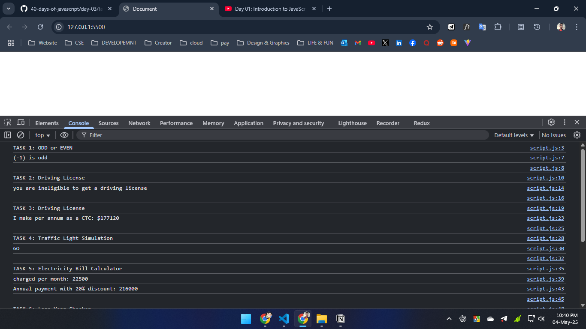
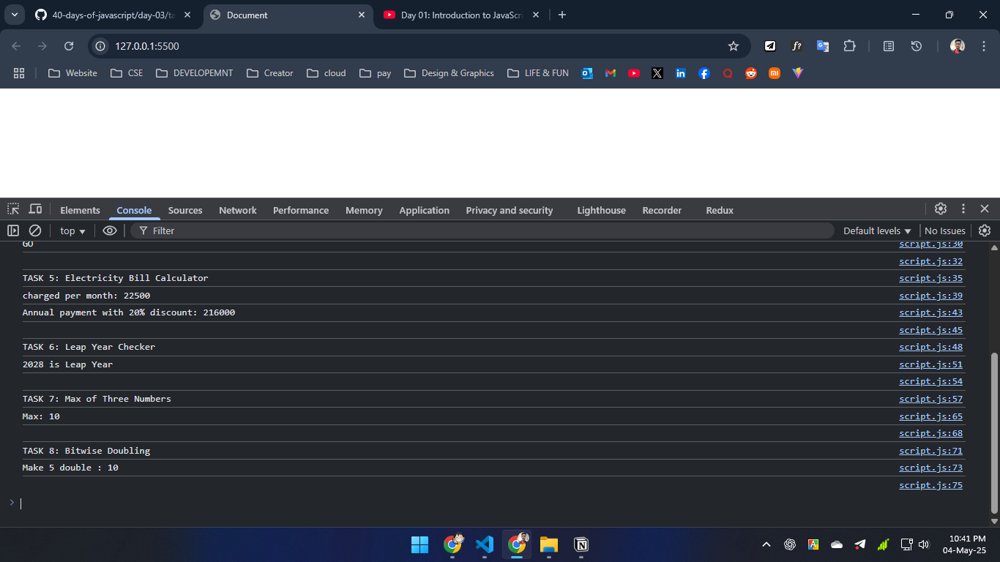

# Day 03

## Most Epic Part

- Logical Operator

  ```js
  // if first true, continue
  // otherwise return first
  console.log(false && false); // false
  console.log(true && false); // false
  console.log(true && true); // true
  console.log(false && true); // false
  console.log('Cow' && 'Horse'); // 'Horse'

  // if first false, continue
  // otherwise return first
  console.log(false || false); // false
  console.log(true || false); // true
  console.log(true || true); // true
  console.log(false || true); // true
  console.log('Cow' || 'Horse'); // 'Cow'

  //if first expression null or undefined, then continue
  // otherwise return first expression
  console.log(null ?? 1); // 1
  console.log(undefined ?? 3); // 3
  console.log(false ?? true); // false
  ```

- Bitwise Operator

  ```js

    15 in binary = 1111
    9 in binary = 1001

    1111 & 1001 = 1001 // 9
    console.log(15 & 9) // 9

    1111 | 1001 = 1111 // 15
    console.log(15 | 9) // 15

    //if digit not same -> 1
    1111 ^ 1001 = 0110 //  6
    console.log(15 ^ 9) // 6


    1001 << 2 = 100100 //  36
    console.log(9 << 2) // 36


    1001 >> 2 = 0010 //  2
    console.log(9 >> 2) // 2
  ```

## Task



