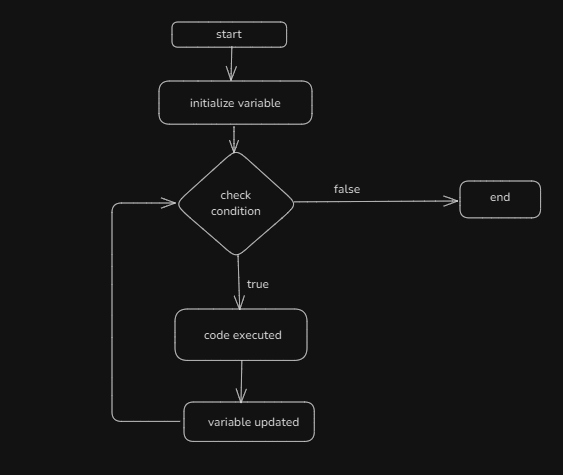
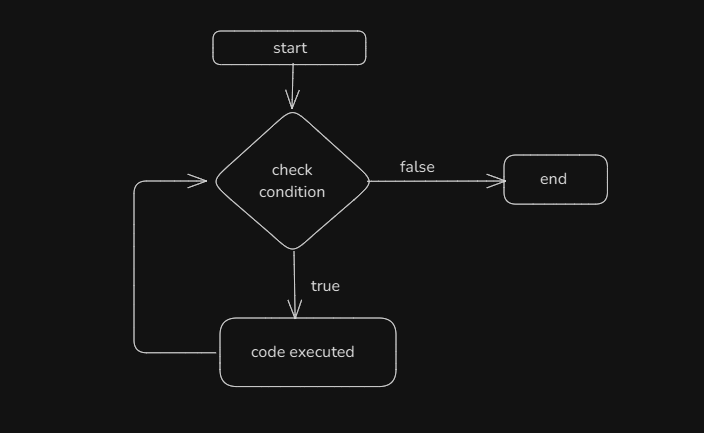
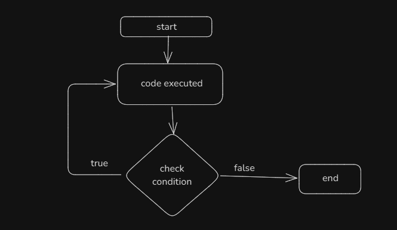
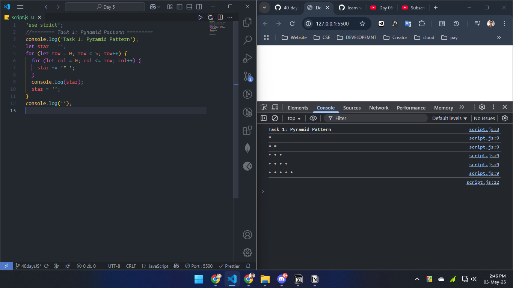
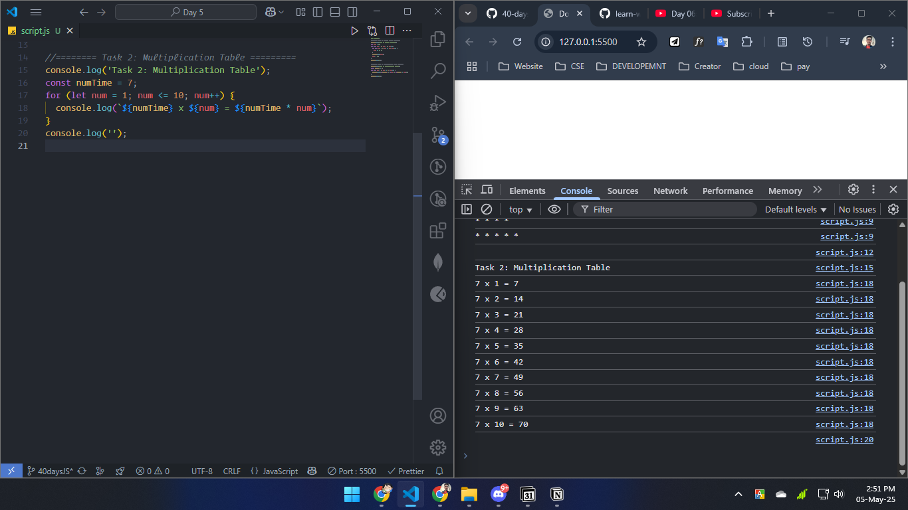
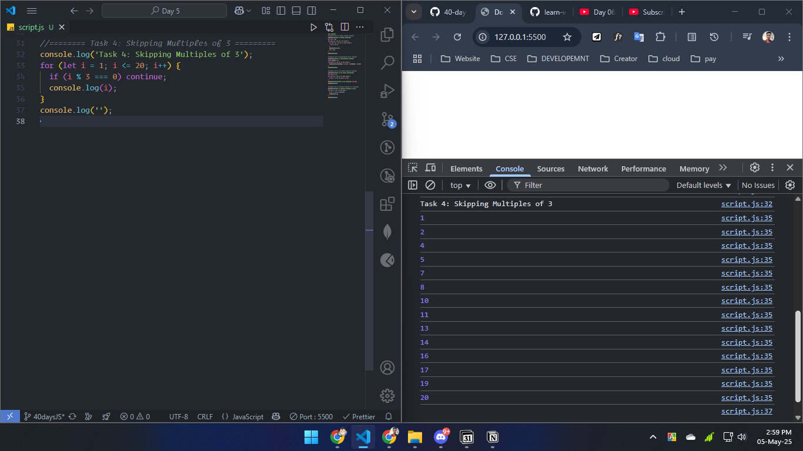
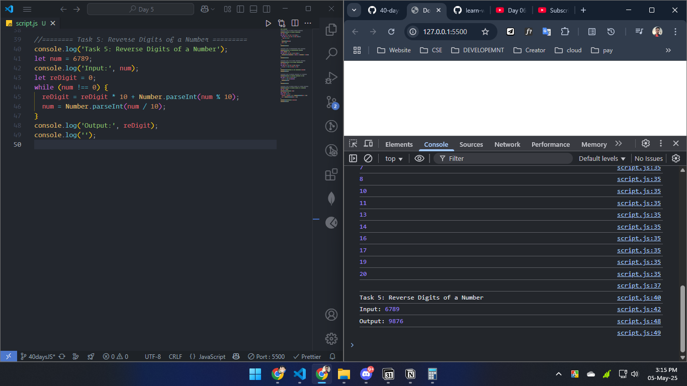

# Day 05

## Most Epic part I learn

- flow chart of these loop

  - for loop

    

  - while loop

    

  - do while loop

    

## Task

### 1. Generate a Pyramid Pattern using Nested Loop

### 2. Create Multiplication Table (Using for loop)

### 3. Find the summation of all odd numbers between 1 to 500 and print them on the console log.

### 4. Skipping Multiples of 3

### 5. Reverse Digits of a Number (Using while loop)

### 6. Write Difefrences between for, while, and do-while loop with their flow charts

| for Loop                                                                              | while Loop                                                                                                                     | do while Loop                                                                              |
| :------------------------------------------------------------------------------------ | :----------------------------------------------------------------------------------------------------------------------------- | :----------------------------------------------------------------------------------------- |
| A for loop is best when we know exactly how many times we need to run a block of code | A while loop runs as long as a given condition is true. It’s best when we don’t know in advance how many iterations are needed | A do while loop ensures that the code executes at least once before checking the condition |
|                                                        |                                                                                               |                                                        |
