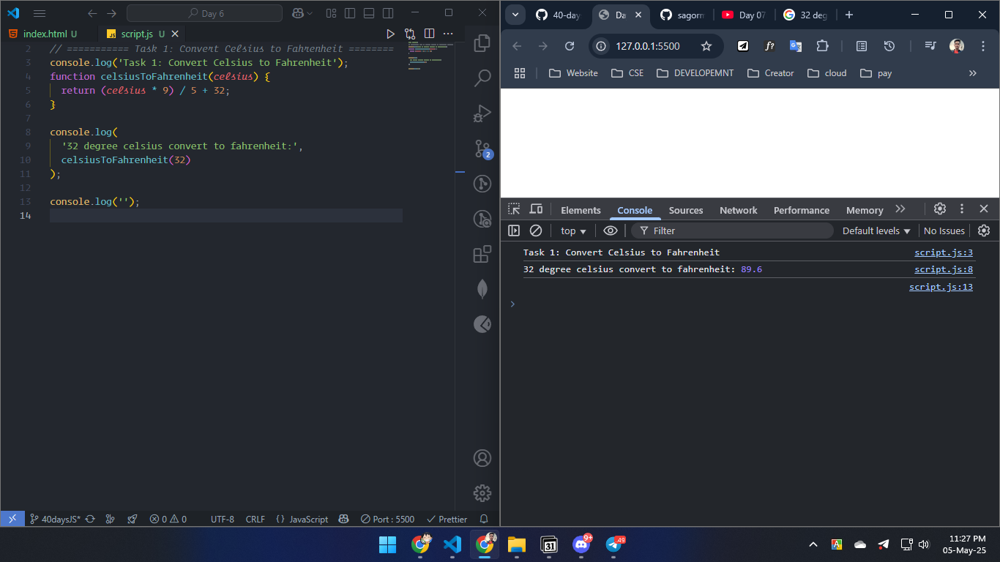
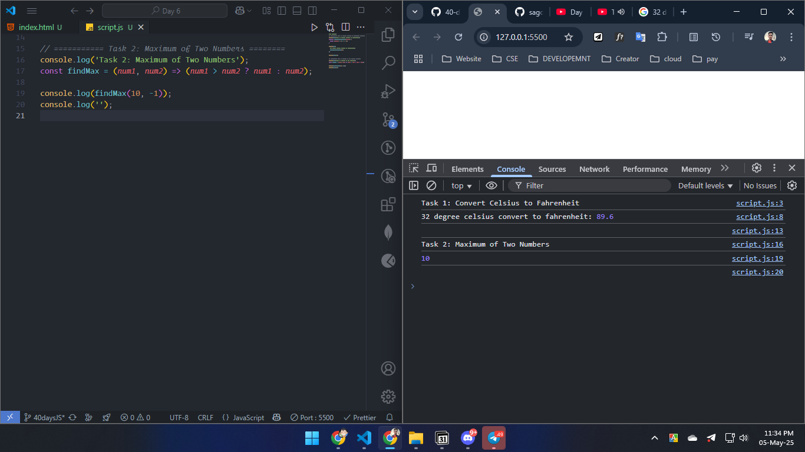
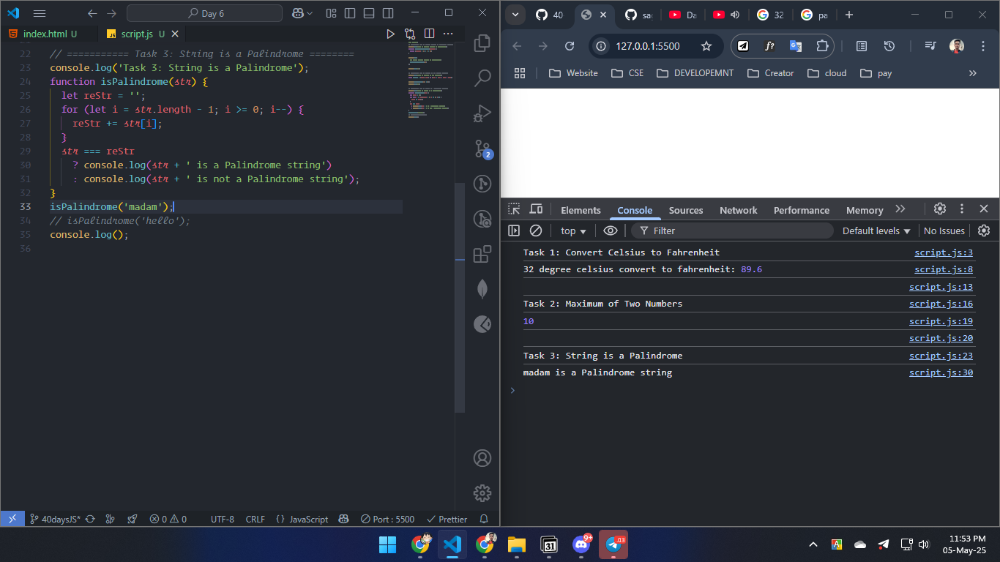
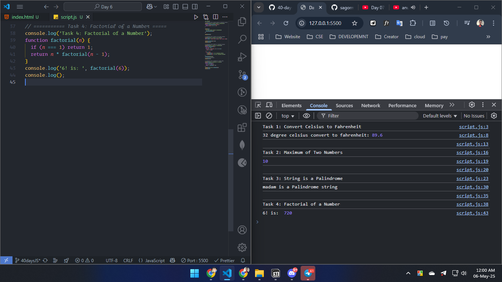
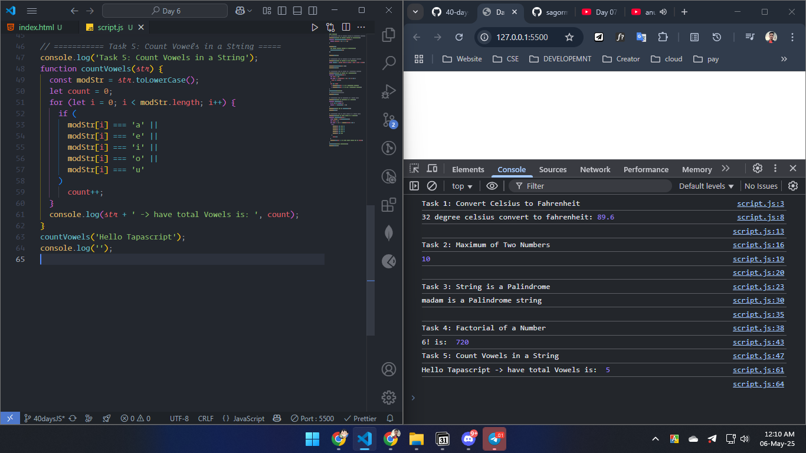
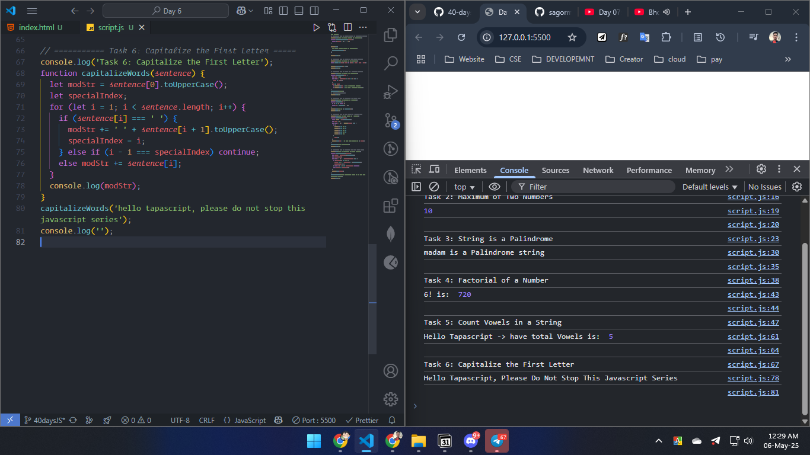
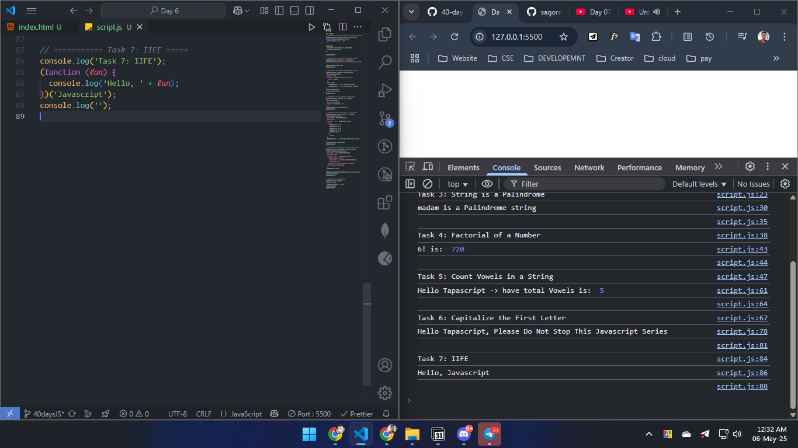
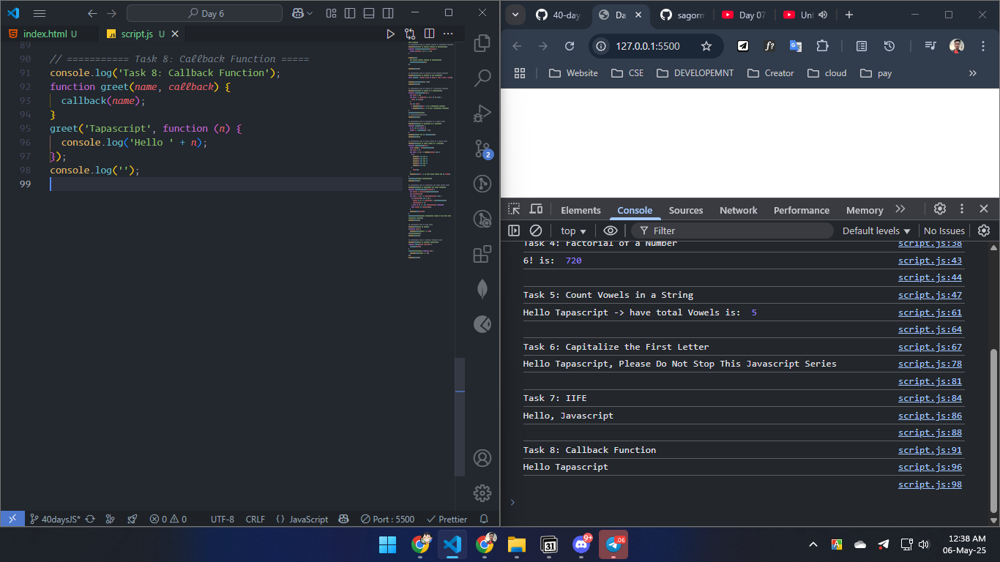
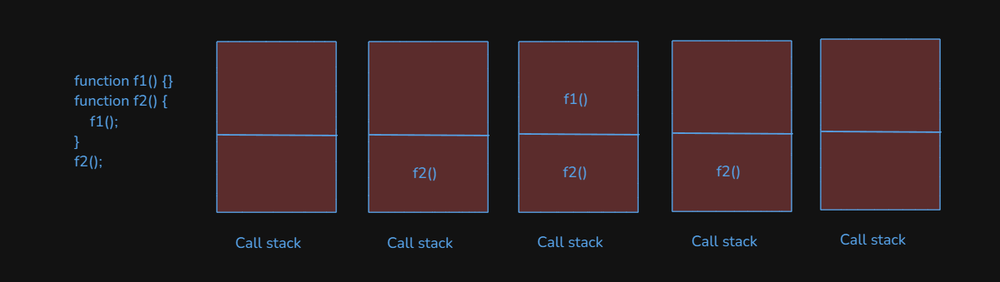
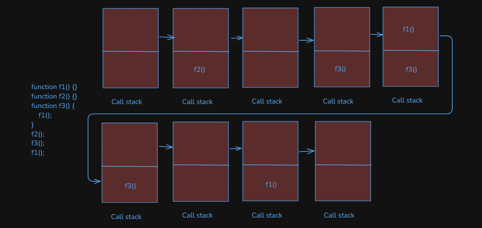

# Day 06

## tasks

### 1. Function to Convert Celsius to Fahrenheit

### 2. Function to Find the Maximum of Two Numbers

### 3. Function to Check if a String is a Palindrome

### 4. Function to Find Factorial of a Number

### 5. function to Count Vowels in a String

### 6. Function to Capitalize the First Letter of Each Word in a Sentence

### 7. Use an IIFE to Print “Hello, JavaScript!”

### 8. Create a Simple Callback Function

### 9. Call Stack Execution Diagram for this flow

### 10. Call Stack Execution Diagram for this flow

